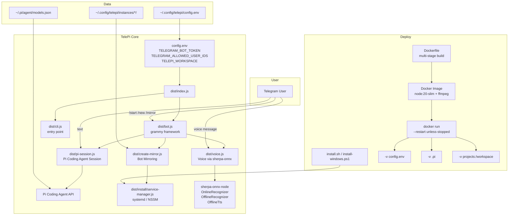

# TelePi Architecture



## Data Flow

```
User → Telegram → bot.js (grammy) → pi-session.js → Pi Coding Agent API → OpenAI/Anthropic/DeepSeek
Voice: User → Telegram (voice) → voice.js → sherpa-onnx → text → pi-session.js
Mirror: User → /mirror → create-mirror.js → new bot instance with own token
```

## Key Files

| Path | Purpose |
|------|---------|
| `dist/index.js` | Entry point, loads config, starts bot |
| `dist/bot.js` | Telegram bot handlers (grammy) |
| `dist/voice.js` | Voice transcription (sherpa-onnx) |
| `dist/pi-session.js` | Pi Coding Agent session management |
| `dist/create-mirror.js` | Bot mirroring (multi-instance) |
| `dist/install/service-manager.js` | Cross-platform service (systemd/NSSM) |
| `Dockerfile` | Multi-stage Docker build |
| `BRIDGE.md` | AI agent entry point |

## Dependencies

- grammy — Telegram Bot API framework
- @mariozechner/pi-coding-agent — Pi Coding Agent integration
- sherpa-onnx-node — local voice recognition (optional)
- ffmpeg — audio conversion (optional, for voice)
